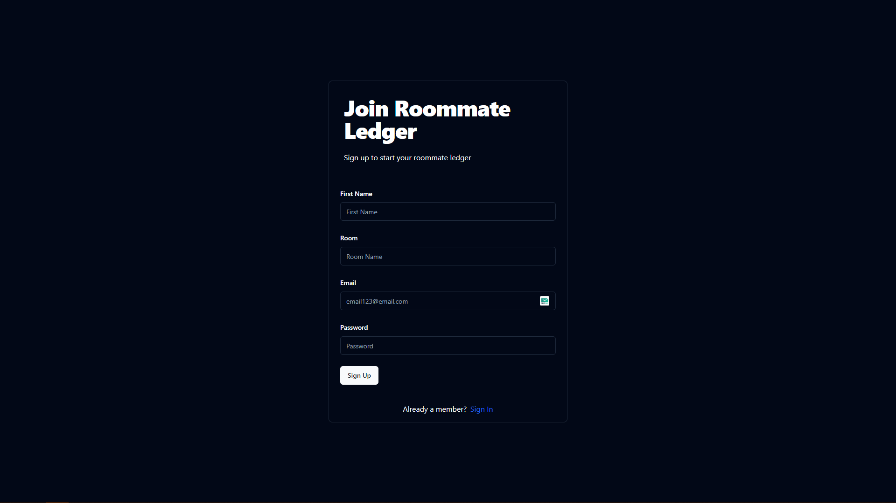
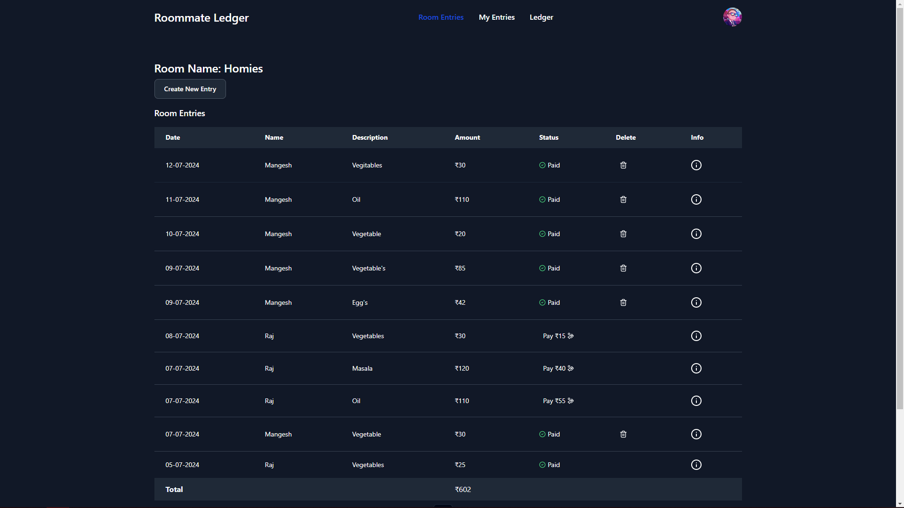
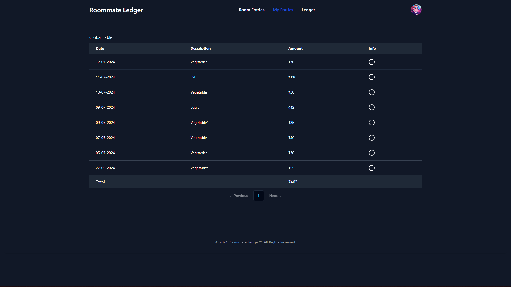
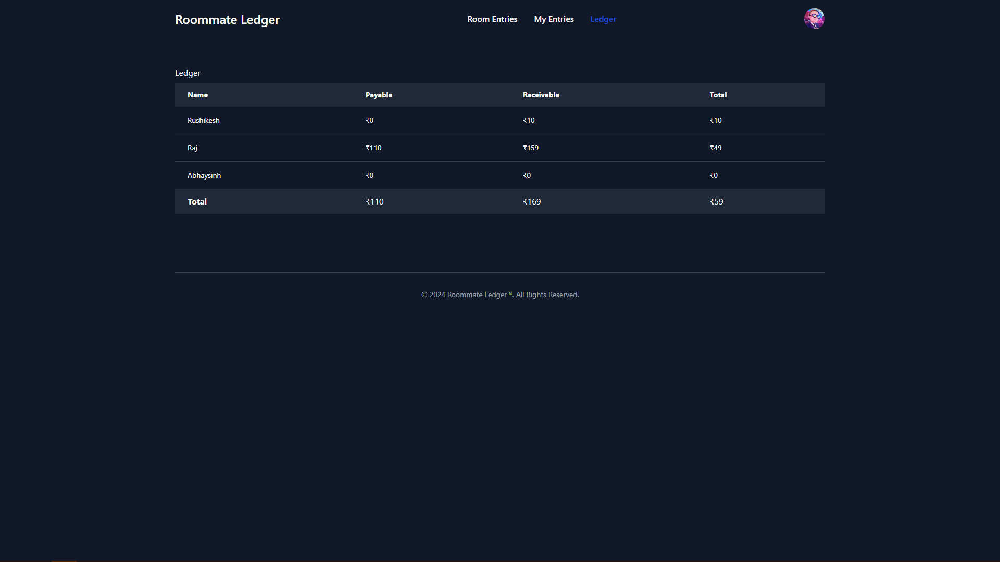
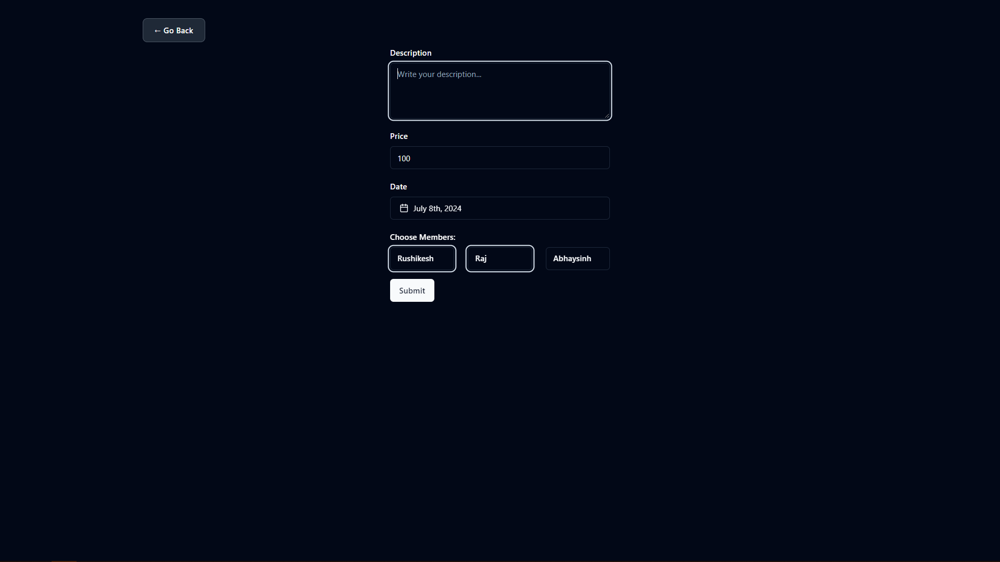

# Roommate Ledger

Roommate Ledger is a web application designed to help you and your roommates keep track of shared expenses. Whether you're splitting rent, utilities, groceries, or other bills, Roommate Ledger makes it easy to manage payments and balances among roommates.

## Features

- **Room Entries**: View all entries of the room with entry details. Options to delete entries or mark them as paid for associated members.
- **Ledger**: Updated automatically upon creating an entry. Columns for name, payable, receivable, and total amounts for all roommates to track how much money you owe or are owed.
- **My Entries**: View your personal entries.
- **Authentication**: Sign up and sign in to manage your entries securely.

## Technologies Used

- **MERN Stack**:
  - **MongoDB**: Database for storing user, entry, and ledger data.
  - **Express**: Backend framework for handling routes and business logic.
  - **React**: Frontend library for building user interfaces.
  - **Node.js**: Server environment for running the backend application.
- **TypeScript**: Typed language for JavaScript, providing type safety and better development experience.
- **Zod**: Schema validation for ensuring data integrity.
- **Shadcn**: Components library for building responsive and stylish UI.
- **Vercel**: Platform for deploying the application.

## Screenshots


*Sign Up Page*


*Dashboard with Room Entries*


*My Entries*


*Ledger Table*


*Add New Entry*

## Getting Started

### Prerequisites

- Node.js
- npm or yarn
- MongoDB


### Installation

1. Clone the repository:
   ```sh
   git clone https://github.com/your-username/roommate-ledger.git
   cd roommate-ledger
   ```

2. Install dependencies for both frontend and backend:
   ```sh
   # In the root directory
   npm install
   cd client
   npm install
   ```

3. Set up environment variables:

   Create a `.env` file in the root directory and add the following:
   ```sh
   VITE_HOST_URL=your_express_app_url : http://localhost:5000
   DB_URL=your_mongodb_uri
   JWT_SECRET=your_jwt_secret
   CLIENT_URL=your_react_app_url : http://localhost:3000
   ```

4. Start the application:

   ```sh
   # In the root directory
   npm run dev

   # In the client directory
   npm start
   ```

5. Open your browser and navigate to `http://localhost:3000`.

## Usage

1. **Sign Up**: Create an account to start using the Roommate Ledger. Use `TestRoom` for Room Name.
2. **Sign In**: Log in to access your dashboard.
3. **Create Entry**: Add new entries by specifying the amount paid and the associated members.
4. **View Room Entries**: See all entries related to the room, with options to delete or update the status.
5. **View My Entries**: Check your personal entries.
6. **Ledger**: Track how much money you owe or are owed by other members.


## Deployment

The project is deployed on Vercel. You can view the live application [here](https://roommate-ledger.vercel.app/)).

## Contributing

Contributions are welcome! Please fork the repository and create a pull request with your changes.


## Contact

For any inquiries, please reach out to [email](mailto:mangeshraje55555@gmail.com).
